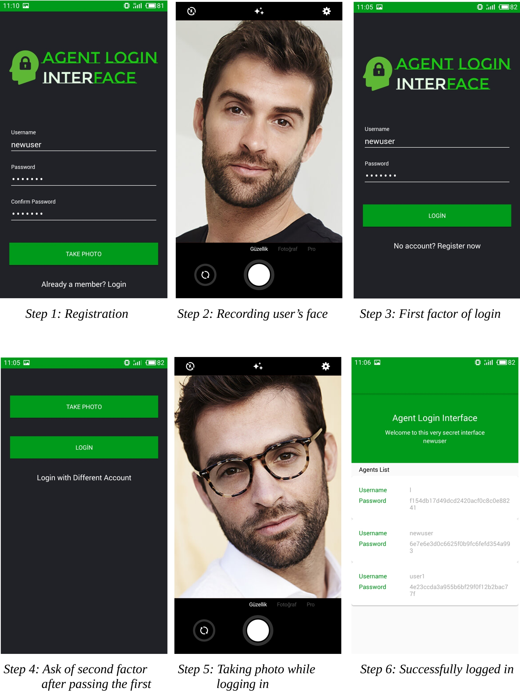

# Two Factor Authentication
In this project, our team implement a two-factor authentication mechanism for your smart phone. Two-factor authentication is a mechanism to further secure an entity’s log in to a computerized system by adding a second factor to the conventional passwords. The second factor to biometrically identify the user (owner of the smart phone) is a statistical method that collects data from phone’s surrounding. Four common examples are as follows: the voice of the user, the face of the user, the movements of the user, and the signature of the user. A face recognition mechanism have been used as a biometric identification practice.

Registration to application have been provided and username, password and a face image (from integrated camera) is expected to givemn by the user during that process. After registration, users are able to log in succesfully with their username, password and face image taken by integrated camera.

## Developer Guide
Username and password data are being stored locally. SQLite, an open-source and lightweight embedded SQL database engine, is used in order to handle user information storaging. SQLite is a RDBMS (Relational Database Management System) and is embedded within Android, so it is an easy and fast DBMS for Android developers.

Just like Linux’s native user data storing mechanism, username is stored in plain-text and password is hashed and salted with a long text, using SHA-256 algorithm. Thus, by using a salt, the security of SHA-256 increased a lot more and it has became very hard to brute force the hashed password, eventhough it is stored offline.

For second factor, a face recognition method is choosed as a biometric authentication method. The method is implemented using [Face++ Face Recognition API](www.faceplusplus.com) which automates the face recognition process in a straightforward way. The API receives the face image through internet and reproduces a token, which is then used by application as the second factor of authentication. For succesful login, the rate of the face recognition must be higher than 85%.

After registering and logging in successfully, a main page appears which shows user informations including usernames, passwords and face token’s of each registered user as a list. This is made for debugging purposes, as main subject of the project is just authentication process. List is implemented to
make sure all users are registered and saved successfully.

## Usage

## Contributors
* Ahmet Seha Çelenk - Interface and Salt&Hashing [Github](https://github.com/tahacorbaci)
* Bora Ünal - First factor of the login&registration. [Github](https://github.com/tahacorbaci)
* Mehmet Taha Çorbacıoğlu - Second factor of the login&registration. [Github](https://github.com/tahacorbaci)

## License
This project is licensed under the MIT License - see the [LICENSE](LICENSE) file for details